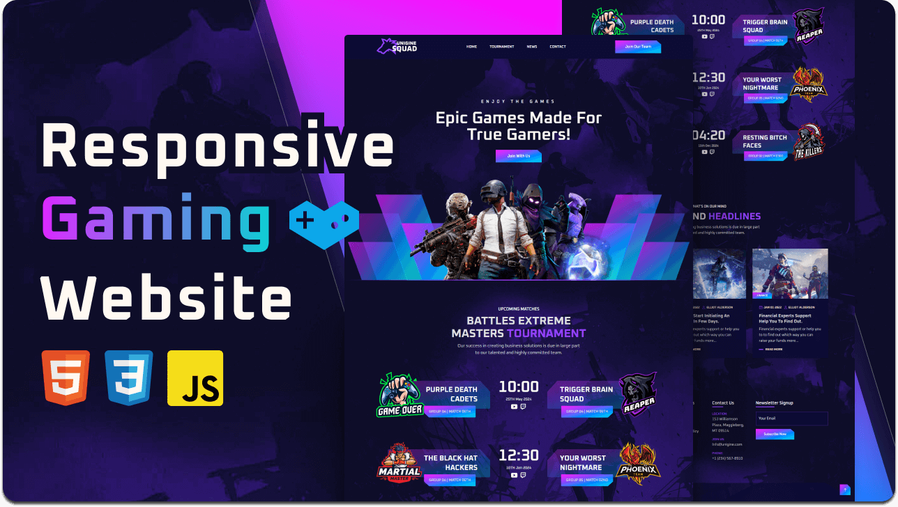

<div align="center">

  <br />
  <br />

  <h2 align="center">GameHive - eSports Gaming Website</h2>

  GameHive is a fully responsive eSports gaming website, built using HTML, CSS, and JavaScript. It offers an engaging platform for gaming enthusiasts with features like tournament tracking, team profiles, and more.

  <a href="https://qtu11.github.io/GameHavi/"><strong>➥ Live Demo</strong></a>

</div>

<br />

## Demo Screenshots



## Features
- Responsive design for desktop, tablet, and mobile devices
- Interactive tournament schedules
- Team and player profiles
- Real-time match updates

## Getting Started
1. Clone the repository:
   ```bash
   git clone https://github.com/qtu11/GameHavi.git

### Additional Notes:
- I checked the live demo link<a href="https://qtu11.github.io/GameHavi/" target="_blank" rel="noopener noreferrer nofollow"></a>, but without access to the actual site or repository, I can’t verify if it’s functional or matches the description. If you’d like me to analyze the live site or specific files, please provide more details or upload relevant content.
- If you want me to generate a chart or visual (e.g., to showcase website responsiveness across devices), let me know the specific data or metrics you’d like to display.

Let me know if you need help refining this further or analyzing specific parts of the project!
